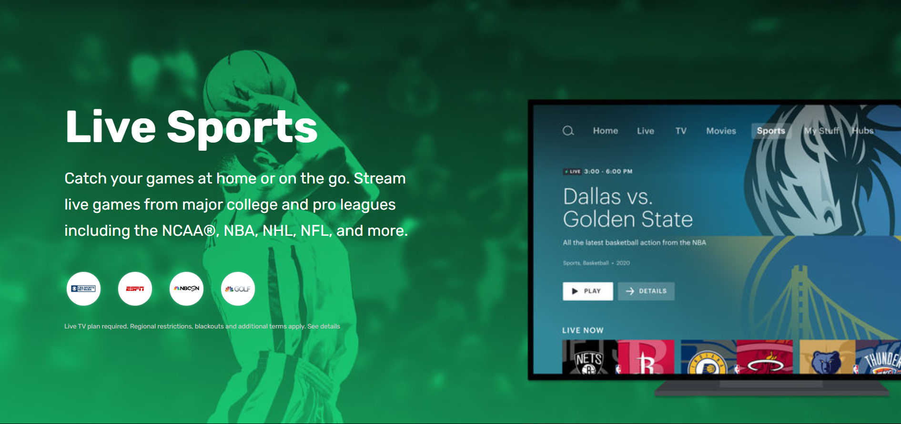

# Hulu Landing Page

Welcome to the Hulu Landing Page project, a fully responsive and interactive landing page designed to showcase the features and content available on Hulu.

## Overview

This project is a recreation of the Hulu landing page, built using HTML, CSS, and JavaScript. It aims to replicate the look and feel of Hulu's official landing page, providing a modern and clean user interface.

## Features

- Responsive design compatible with various devices and screen sizes.
- Interactive navigation menu with smooth scrolling.
- Featured content carousel/slider.
- Sections highlighting popular shows, movies, and Hulu originals.
- Call-to-action buttons for user engagement.
- Footer with social media links and additional information.

## Technologies Used

- HTML5 for the structure of the webpage.
- CSS3 for styling, including Flexbox and Grid for layout.
- JavaScript for interactivity and dynamic content.
